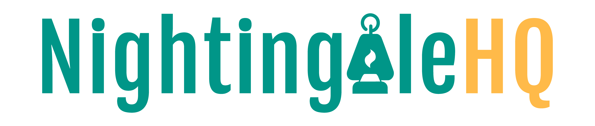
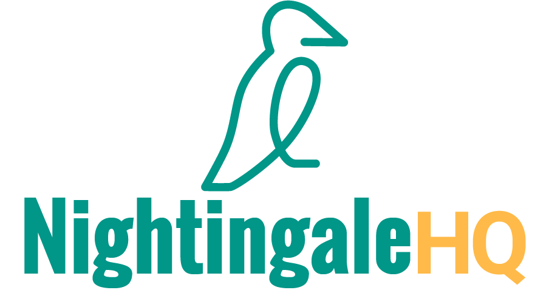
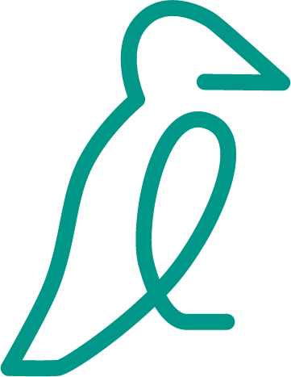
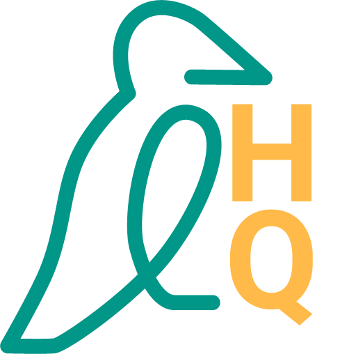

# Nightingale HQ Assets
&copy; All copy rights asserted - Nightingale HQ Limited 

# Rules of use
We have an icon and a wordmark, which both have an alternative version that can be used if needed. We prefer our assets are used in full colour whenever possible, but also provide white versions for when it's not. 

We provide all of our visual assets in PNG and SVG format so you can choose whichever suits your needs. The following examples will use the PNG's.

**For online use, we provide RGB versions of our assets.**

**For print use, we have CMYK versions coming very soon.**

# Our wordmark
Our first preference is to use our full colour wordmark where possible (`rgb/NGHQ_WORDMARK_RGB.png`)  
  

For when that aspect ratio may not work, we also provide an alternative wordmark (`rgb/NGHQ_WORDMARK_ALT_RGB.png`)  
  

# Our icon
If you need an icon instead of a full logo, we have the full colour Nightingale icon (`rgb/NGHQ_ICON_RGB.png`) 
 

And the alternative full colour Nightingale icon which work well if you need a square aspect ratio (`rgb/NGHQ_ICON_ALT_RGB.png`)  
