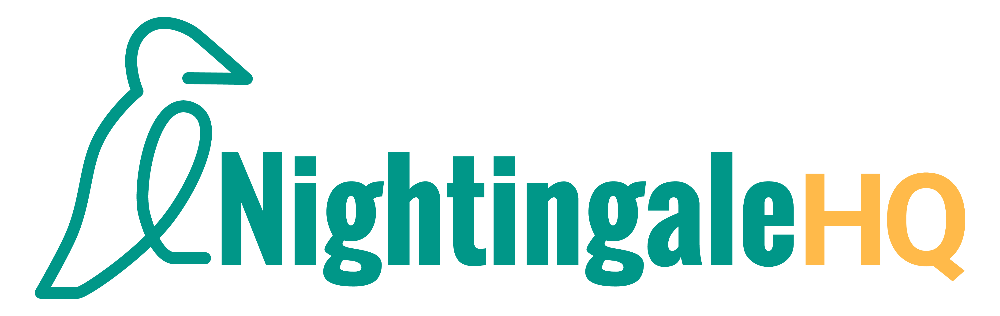
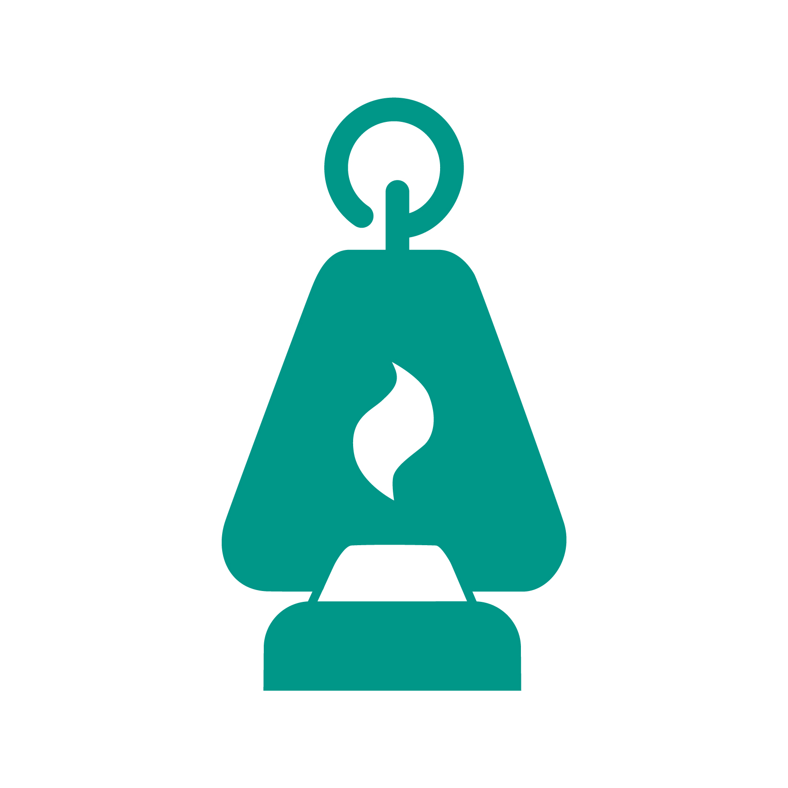

# Nightingale HQ Assets
&copy; All copy rights asserted - Nightingale HQ Limited 

# Rules of use
We have an icon and a wordmark. We prefer our assets are used in full colour whenever possible, but also provide white versions for when it's not. 

We provide all of our visual assets in PNG, JPG and SVG format so you can choose whichever suits your needs. You should only use the PNG's in small format. The following examples will use the JPG's.

**For online use, we provide RGB versions of our assets.**

**For print use, we have PRINT versions of our assets.**

**Please do not modify our assets in any way.**

# Our wordmark
Our first preference is to use our full colour wordmark where possible (`rgb/NGHQ_WORDMARK_RGB.jpg`)  
  

If you can't use that version, we also provide a white version for use on darker/similar colour backgrounds (`white/NGHQ_WORDMARK_WHITE.png`). Available in both PNG and SVG format. 

If you're using the wordmark in print, please use the PDF version from the `print` folder.

# Our icon
If you need an icon instead of a full logo, our preferred icon is the full colour Nightingale HQ icon (`rgb/NGHQ_ICON_FULL_SQUARE_RGB.jpg`) 
 

We also provide a solid green one (like the one seen in the wordmark) that can be used if the full colour one isn't appropriate for your use (`rgb/NGHQ_ICON_GREEN_SQUARE_RGB.jpg`). 
 

For darker/similar colour backgrounds, we also provide a white version (`white/NGHQ_ICON_WHITE_SQUARE.png`). Available in both PNG and SVG format.  

If you're using the icon in print, please use the PDF version from the `print` folder.

# Our pallette
We also provide a PDF of our colour palette which gives the different values required for our colour palette (`NightingaleHQ-Palette-v1.pdf`).